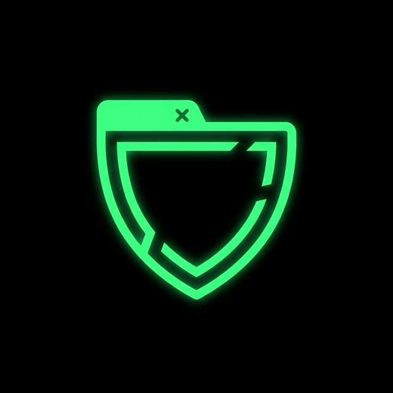
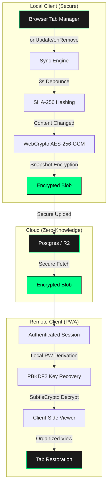

<div align="center">
  
</div>

# VaultTabs

<div align="center">

**Your tabs are your mind. We sync it. We encrypt it. We never read it.**

[](#)
[](#)
[](#)
[](#)

[](#)
[](#)
[](#)
[](#)
[](#)

[Live Demo](https://vaulttabs.vercel.app) • [Architecture Audit](C:\Users\ujjwa\.gemini\antigravity\brain\71197cd8-6790-438d-a567-5aa7238e31ad\vaulttabs_deep_dive.md)

</div>

---

## ◈ The Problem
Most tab sync tools POST your URLs to a server and call it a day. Native browser sync is vendor-locked, opaque, and built on trust you never explicitly gave. Chrome syncs to Google, Safari syncs to Apple. Neither gives you control over what they can read.

## ◈ The Solution: VaultTabs
VaultTabs encrypts your tab state **before it leaves your machine** — with a key the server has never seen and mathematically cannot derive. What reaches the cloud is opaque ciphertext. What stays private is your entire working context.

**The server is an untrusted storage node. That's the point.**

---

## 🛠️ System Architecture



### The Encryption Model
VaultTabs uses a **master-key wrapping architecture**, mirroring the security protocols of professional password managers.

| Component | Responsibility |
| :--- | :--- |
| **Master Key** | 256-bit AES-GCM. Generated client-side. Never leaves the device in plaintext. |
| **Wrapping Key** | Derived via PBKDF2-HMAC-SHA256 (100k rounds) from your password. |
| **Snapshot** | Encrypted with the Master Key. The server sees only blobs + timestamps. |

> [!IMPORTANT]
> **Zero-Knowledge means Zero-Reset.** Forget your password, and your data is mathematically unrecoverable. 

---

## 🚀 Phase 1: Completed (v1.0.0)
- ✅ **Zero-Knowledge Core**: Full PBKDF2/AES key-wrapping pipeline.
- ✅ **Smart Sync**: Event-driven capture with 3s debounce and SHA-256 hash gating.
- ✅ **MV3 Resilience**: SSE Heartbeat mechanism to persist Service Workers.
- ✅ **Cross-Platform**: Chromium extension + PWA for mobile access.
- ✅ **Structured Restore**: Preserves window topology and tab metadata.

---

## 📥 Getting Started

### The Docker Way (Recommended)
Run the entire stack (PWA + Backend + DB) with one command:
```bash
# 1. Setup environment
cp .env.example .env

# 2. Boot everything
docker compose up -d

# 3. Run migrations
docker compose exec backend npm run db:migrate
```
*Access the dashboard at `http://localhost:3001`.*

### Manual Development
1. **Backend**: `cd backend && npm install && npm run dev`
2. **PWA**: `cd pwa && npm install && npm run dev`
3. **Extension**: `cd extension && npm install && npm run dev`

---

## ❓ FAQ

**Q: Is my master key sent to the server?**  
A: No. A *wrapped* version of it is sent. The server can only see the encrypted blob and the salt used for derivation. Without your password, it is mathematically inert.

**Q: Does VaultTabs capture Incognito tabs?**  
A: No. VaultTabs respects browser privacy boundaries. Incognito tabs are never captured.

**Q: What happens if I change my password?**  
A: Currently, password changes require re-wrapping the master key. This is a local operation that syncs the new vault to the cloud.

---

## 📂 Architecture Overview

```bash
/extension     # WXT engine, sync logic, WebCrypto implementation
/backend       # Fastify API, Zod validation, Postgres storage
/pwa           # Next.js dashboard, client-side decryption layer
/shared        # Common types and API interfaces
```

---

## 🛡️ Security Disclaimer
VaultTabs is designed for users who prioritize privacy over recovery convenience. There are no backdoors, no "forgot password" emails, and no surveillance mechanisms. **Your workspace belongs entirely to you.**

---

<div align="center">

**Built on the principle that privacy shouldn't require trust.**

*[vaulttabs.vercel.app](https://vaulttabs.vercel.app)*

</div>
