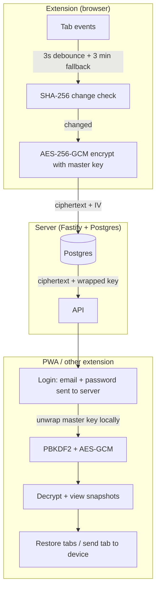

<div align="center">
  
</div>

# VaultTabs

<div align="center">

**Sync your open tabs across browsers. Snapshots are encrypted on your device before they are uploaded.**

[](#security-model--limitations)
[](#)
[-orange?style=flat-square)](#security-model--limitations)

[](#)
[](#)
[](#)
[](#)

[Live Demo](https://vaulttabs.vercel.app)

</div>

---

> [!IMPORTANT]
> **VaultTabs is NOT zero-knowledge.** Tab snapshots are encrypted in the browser with AES-256-GCM, so a
> stolen database contains no readable tab data. But your **account password is sent to the server** at
> sign-up and login (over TLS, and hashed there), and that same password is what protects your master
> key. A server operator who captures passwords (modified code, logging, a compromised TLS terminator) can
> unwrap your master key and decrypt your snapshots. Details in
> [Security model & limitations](#security-model--limitations).

## The Problem
Most tab sync tools POST your URLs to a server in plaintext. Native browser sync is vendor-locked and opaque.

## What VaultTabs does
- The extension captures your open `http(s)` tabs (never incognito tabs) and encrypts the list **in the browser** with a random 256-bit AES-GCM master key before uploading.
- The master key is itself encrypted ("wrapped") with a key derived from your password (PBKDF2-HMAC-SHA256, 100,000 iterations) and, optionally, with a one-time recovery code. Only the wrapped copies are sent to the server.
- The PWA and other extensions log in, receive the wrapped key, unwrap it locally with your password, and decrypt snapshots locally.

What it does **not** do: hide your email, device names, timestamps or snapshot sizes from the server, or protect you from a server operator who is willing to capture your password. See below.

---

## System Architecture


```mermaid
graph TB
    subgraph "Extension (browser)"
        A[Tab events] -->|3s debounce + 3 min fallback| B[SHA-256 change check]
        B -->|changed| C[AES-256-GCM encrypt with master key]
    end

    subgraph "Server (Fastify + Postgres)"
        C -->|ciphertext + IV| F[(Postgres)]
        F -->|ciphertext + wrapped key| G[API]
    end

    subgraph "PWA / other extension"
        G --> H[Login: email + password sent to server]
        H -->|unwrap master key locally| I[PBKDF2 + AES-GCM]
        I --> J[Decrypt + view snapshots]
        J --> K[Restore tabs / send tab to device]
    end
```

### Encryption model (what the code does)

| Component | Detail |
| :--- | :--- |
| **Master key** | Random AES-256-GCM key generated client-side. The raw key is never sent to the server. Kept in IndexedDB as a non-extractable `CryptoKey` (not password-encrypted while stored). |
| **Wrapping key** | PBKDF2-HMAC-SHA256, 100,000 iterations, 32-byte random salt (stored on the server), derived from your password. Wraps the master key with AES-GCM (random 96-bit IV). |
| **Snapshots** | JSON list of tabs (URL, title, favicon URL, window/index/pinned/active) encrypted with the master key, fresh random 96-bit IV per snapshot. No additional authenticated data (see limitations). |
| **Recovery code** | `VAULT-XXXX-XXXX-XXXX-XXXX-XXXX`, 20 random characters (~100 bits). A second copy of the master key is wrapped with a PBKDF2 (50,000 iterations) key derived from it. The server stores that wrapped copy plus a scrypt hash of SHA-256(code) as a verifier. The code itself is shown once and never stored. |
| **Login** | `POST /auth/login` with email + **plaintext password over TLS**; the server verifies it against an scrypt hash and returns a JWT (HS256, 30 day default lifetime) plus the wrapped master key and salt. |

> [!WARNING]
> There is no "forgot password" email. If you lose both your password and your recovery code, your
> snapshots cannot be decrypted. Using the recovery code invalidates it and does not generate a new one.

---

## Getting Started

### Docker
The Docker setup (`docker-compose.yml`, Dockerfiles) was reworked in the latest security pass and has **not been
build-tested** yet. If it fails for you, use the manual setup below and please report the error.

```bash
# 1. Setup environment (POSTGRES_PASSWORD and JWT_SECRET are required)
cp .env.example .env
#    generate values:  node -e "console.log(require('crypto').randomBytes(32).toString('hex'))"

# 2. Build and boot everything (the backend applies DB migrations on start)
docker compose up -d --build
```
The PWA is on `http://localhost:3001` and the API on `http://localhost:3000`. Postgres is bound to `127.0.0.1` only.
The containers speak **plain HTTP**: put a TLS reverse proxy in front before exposing them beyond localhost
(passwords and tokens are otherwise sent in clear text). For production add `-f docker-compose.prod.yml`
(requires Docker Compose v2.24+).

`NEXT_PUBLIC_API_URL` is baked into the PWA bundle at **build time**; rebuild the `pwa` image after changing it.

### Manual development
This is an npm workspaces monorepo (`backend`, `extension`, `pwa`, `shared`).

```bash
# from the repo root
npm install
npm run build --workspace=shared          # backend/extension/pwa import @vaulttabs/shared
```

1. **Postgres**: Postgres 13+ (the schema uses `gen_random_uuid()`). Put its URL in `backend/.env` (see `backend/.env.example`; for a local non-TLS database set `DATABASE_SSL=disable`).
2. **Backend** (port 3000):
   ```bash
   cd backend
   cp .env.example .env        # set DATABASE_URL and a real JWT_SECRET (>= 32 chars)
   npm run db:migrate
   npm run dev
   ```
   By default the server serves HTTPS using a local [mkcert](https://github.com/FiloSottile/mkcert) certificate from `/certs` (`cd certs && mkcert <your-ip-or-hostname>`; `update-ip.ps1` automates this on Windows). Certificates are **not** in the repo. Set `HTTPS_ENABLED=false` for plain HTTP.
3. **PWA** (port 3001): create `pwa/.env.local` with `NEXT_PUBLIC_API_URL=https://<host>:3000/api/v1`, then `cd pwa && npm run dev`. `npm run dev` starts a custom **HTTPS** server that also needs the mkcert certificate in `/certs`; for plain HTTP use `npx next dev -p 3001`.
4. **Extension**: create `extension/.env.local` with `VITE_API_URL=https://<host>:3000/api/v1`, then `cd extension && npm run dev` (Chrome) or `npm run dev:firefox`. Restart after changing the env file. The Firefox config uses Manifest V2 and a placeholder add-on ID (`vaulttabs@yourdomain.com`) that you must replace for distribution.

Scripts: backend `dev` / `build` / `start` / `db:migrate` / `db:cleanup`; PWA `dev` / `build` / `start`; extension `dev` / `build` / `zip` (+ `:firefox` variants). The repository has no automated test suite; `backend/test/` holds two manual scripts.

> `pwa/public/vaulttabs-extension.zip` is a prebuilt extension package served by the PWA landing page. It is a snapshot of an older build and may not contain the fixes in this repo. Rebuild it (`cd extension && npm run zip` with your `VITE_API_URL`) before distributing.

---

## Security model & limitations

### Who can see what

| Data | Server / DB operator sees it? |
| :--- | :--- |
| Tab URLs, titles, favicons, window layout | Only as AES-256-GCM ciphertext. **Readable by anyone who obtains your master key**, which includes anyone who learns your password (see next section). |
| Email address | **Yes, plaintext.** |
| Account password | **Yes, in plaintext during register / login / account deletion / recovery requests** (over TLS; stored only as an scrypt hash). |
| Device names, device IDs | **Yes, plaintext.** (Defaults look like "Chrome on Windows".) |
| Browser fingerprint | **Yes**: a SHA-256 of user agent, language, timezone offset, screen size, color depth and CPU core count, used to re-identify a device. |
| Timestamps, snapshot count and **size** of each snapshot | **Yes.** Size correlates with number/length of tabs. |
| IP address, request timing | **Yes** (any web server sees these). |
| "Send tab to device" target URL | **Yes, plaintext.** It is stored in `restore_requests.target_url` and sent to the target device without encryption. Restore error messages are plaintext too. |
| Wrapped master key + salt + IV (password) | Yes (ciphertext). Anyone holding a DB dump can attempt an offline guess of your password against it, limited only by PBKDF2 with 100k iterations. |
| Wrapped master key (recovery) + scrypt hash of SHA-256(recovery code) | Yes. The code has ~100 bits of entropy so offline guessing is infeasible. |
| Master key (raw), recovery code (raw) | No. Never sent. |

### Why it is not zero-knowledge
1. **The password is sent to the server.** `RegisterPayload` / login send `password` in the request body. The wrapping key that protects your master key is derived from that same password and a salt the server also stores. A server (or anything that can read decrypted request bodies: a logging proxy, a TLS-terminating load balancer, a compromised deploy) that keeps passwords can unwrap the master key and decrypt every snapshot.
2. **The PWA is served by the same operator.** A malicious or compromised server can ship modified JavaScript that exfiltrates the key or plaintext. The same applies to the prebuilt extension package hosted next to it.
3. There is **no device pairing / key exchange**: every device gets access by logging in with the account password.

### Other threats and how they are (not) handled
| Threat | Status |
| :--- | :--- |
| Database-only breach | Attacker gets ciphertext, wrapped keys, scrypt hashes and metadata. Snapshots stay protected as long as the password is not guessed (PBKDF2 100k is weak by today's guidance for short passwords). |
| Network attacker | Protected only if you deploy TLS. Local dev uses mkcert certificates; the Docker compose files serve plain HTTP. The extension will talk to whatever `VITE_API_URL` says, including `http://`. |
| Stolen/unlocked browser profile | The master key (non-extractable `CryptoKey`) stays in IndexedDB and the JWT in `localStorage` (PWA) or `chrome.storage.local` (extension), both **unencrypted**, until you log out. The non-extractable flag stops key export by script but not use of the key. |
| XSS in the PWA | Full compromise of an open session: token in `localStorage`, key usable from IndexedDB. The PWA sets no Content-Security-Policy. |
| Malicious/compromised server against the extension | Snapshot ciphertext is authenticated (AES-GCM) so it cannot forge tabs, but it **can replay or roll back** older snapshots (no additional authenticated data / version binding) and can ask the extension to open any `http(s)` URL through the plaintext `target_url` field. Non-http(s) URLs are refused. |
| Token theft | JWTs are HS256 with a 30 day default lifetime (`JWT_EXPIRY`); there is no revocation and no refresh, and existing tokens stay valid after a password reset. |
| Brute force | Global rate limit 100 req/min per IP; login, recovery and register have stricter per-IP limits. Rate limiting keys on the socket IP; set `TRUST_PROXY=true` only behind a proxy that sets `X-Forwarded-For`. |
| Incognito tabs | Filtered out by the extension even if you enable it in private windows. |

### Known gaps and recommendations (not implemented)
1. **Stop sending the account password.** Derive a separate authentication secret client-side (domain-separated KDF) or adopt an aPAKE such as OPAQUE, and store only a hash of that. This requires a migration and is the change needed before VaultTabs can honestly be called end-to-end / zero-knowledge.
2. Raise KDF cost (PBKDF2 at 600k+ iterations or Argon2id) with per-account stored parameters so it can be upgraded; raise scrypt cost for the server-side hash (versioned hash format).
3. Encrypt `target_url`, error messages and (optionally) device names with the master key. Consider dropping the browser fingerprint.
4. Bind snapshots to context with AES-GCM additional authenticated data (user, device, timestamp, version) to stop rollback/swapping.
5. Short-lived access tokens with refresh and server-side revocation; invalidate tokens on password reset. Prefer an httpOnly cookie over `localStorage` in the PWA and add a CSP.
6. Optionally protect the stored master key with a local passphrase or OS/WebAuthn secret.
7. There is no "change password" feature (only recovery). Using the recovery code consumes it and none is regenerated.
8. Emails are matched case-sensitively.
9. The committed `certs/*.pem` files from earlier revisions (mkcert leaf certificates and **private keys** for `100.129.163.119`, `100.129.172.20`, `172.23.0.1`) were removed from the working tree and `.gitignore` now blocks them, but they remain in git history. Treat those keys as compromised: regenerate certificates locally and, if you care about the history, purge it with `git filter-repo`.

## FAQ

**Q: Is my master key sent to the server?**
A: Not in raw form. A password-wrapped copy and a recovery-code-wrapped copy are stored on the server. But your password is also sent to the server, and it is the input that unwraps the key (see [Why it is not zero-knowledge](#why-it-is-not-zero-knowledge)).

**Q: Does VaultTabs capture Incognito tabs?**
A: No. Tabs with `incognito: true` are excluded, and only `http://` / `https://` tabs are captured.

**Q: What happens if I change my password?**
A: There is currently no change-password feature. You can reset it with your recovery code (this re-wraps the master key with a new password client-side; the recovery code is then used up).

**Q: How often does it sync?**
A: About 3 seconds after tab changes (debounced), plus a 3-minute fallback check, and only if the tab list changed.

---

## Repository layout

```bash
/extension     # WXT extension (Chrome MV3, Firefox MV2 config), sync logic, WebCrypto
/backend       # Fastify API, Zod validation, Postgres storage
/pwa           # Next.js dashboard, client-side decryption
/shared        # Shared types and API interfaces
/docker        # Postgres init SQL
/certs         # Local dev TLS certs go here (git-ignored, generate with mkcert)
```

---

<div align="center">

*[vaulttabs.vercel.app](https://vaulttabs.vercel.app)*

</div>
